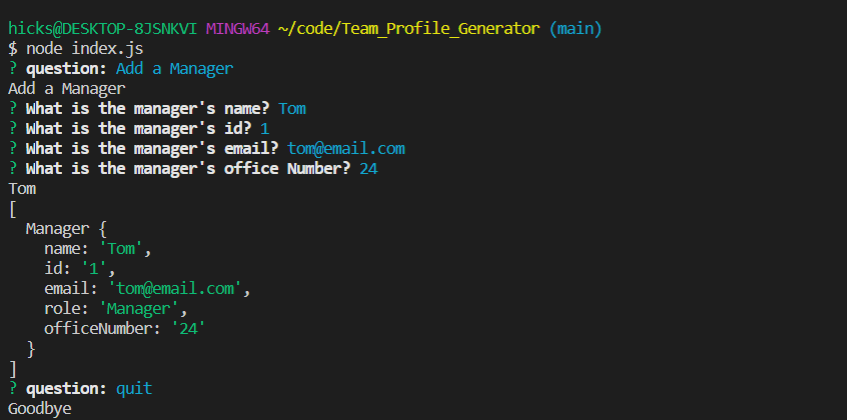

# Team Profile Generator

## Description
The Team Profile Generator is a node application that allows you to input your team roles, ids, and other information into a node package. Once the information is gathered it creates an html document with the input data and creates a team profile webpage. 

## Table of Contents
- [Installation](#installation)
- [Usage](#usage)
- [Contribution](#contribution)
- [License](#license)
- [GitHub](#github)
- [Contact](#contact)

## Installation
This package uses Node and you will need to install Node in order to use this application. Just type "npm i" in the terminal in this project's file location. 

 Please visit the [NodeJS](https://nodejs.dev/learn/how-to-install-nodejs) website for further instruction on how to install and use NODE on your specific device. 

Once Node is installed you are good to run the program. 

## Usage

To start you will need to navigate to the Team_Profile_Generator in your terminal using the change directory command (cd). Once you have navigated to you can run "node index.js" to start up the program. You can also open the integrated terminal in VSCode for easier access. You will then follow the prompts given in the terminal. After the prompts are filled out you can open the html document in your preferred browser and see your created team.  

Please watch this video for an in depth guide on how to use the app https://youtu.be/ux5ALsfkSIA. 

## Contribution
Code created by Jeff Hicks. 

## License
This project is licensed with MIT License. 

## GitHub
https://github.com/Jixxin

## Contact
- Author: Jeff Hicks
- Email: hicks.jeff@me.com